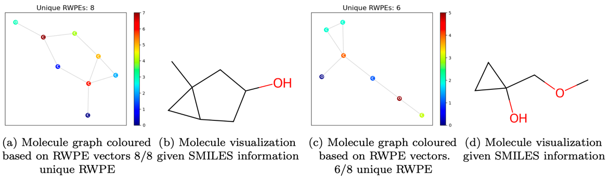
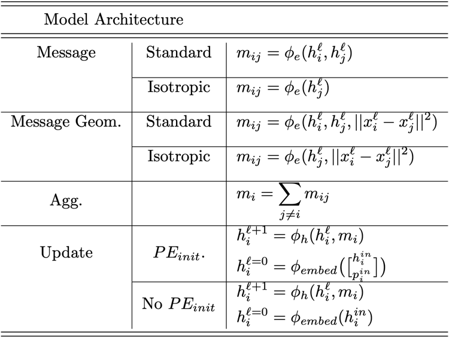
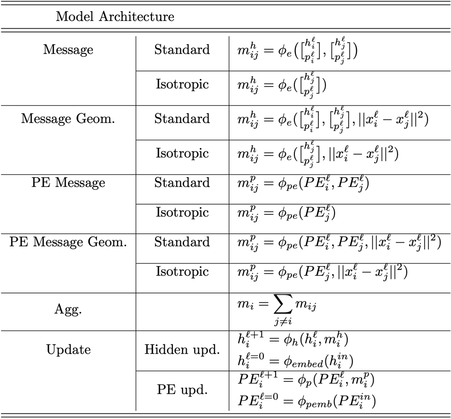
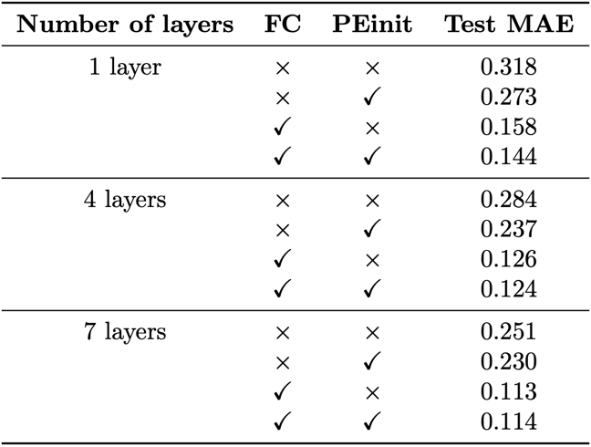
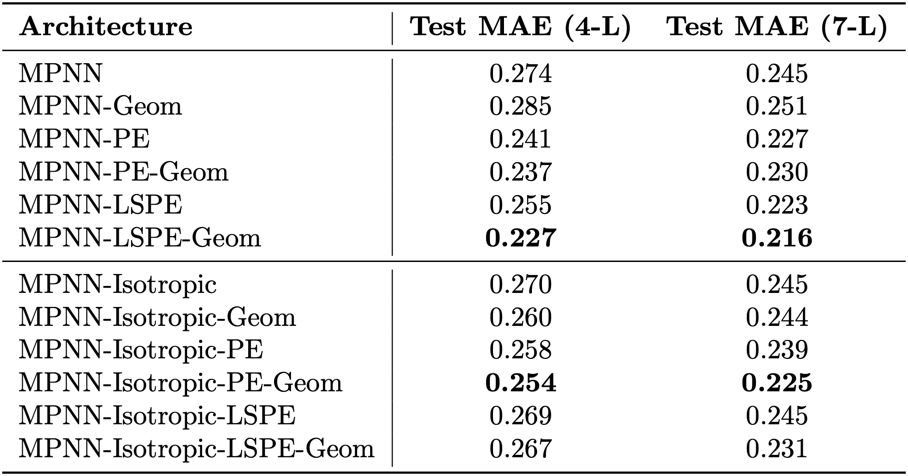
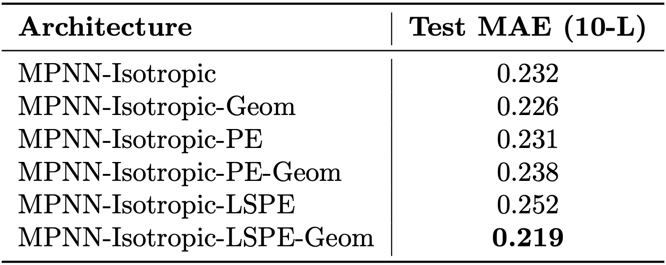

# GeTo-LSPE: Geometry and Topology through Learnable Structural and Positional Encodings

You can alternately read our [Article version of this blogpost](https://github.com/gerardPlanella/LSPE-EGNN/article.pdf).

## Introduction

Graph Neural Networks (GNNs), dating back to the 1990s, [Sperduti, 1993, Gori et al., 2005,
Bruna et al., 2014, Kipf and Welling, 2016] have ascended from a niche of representation learning to one of its most successful methods. GNNs are commonly used for analyzing and processing
graph data, as they have the capability to learn using local information and, to some extent, the
global structural information of a graph. Their applications span a wide range of domains, from
recommender systems [Ying et al., 2018] to drug discovery [Han et al., 2021].

A rather significant role in the success of GNNs is partially attributed to the message-passing
framework [Gilmer et al., 2017a], which enables nodes in a graph to exchange and aggregate information through iterative message passing steps, enhancing their representation and facilitating
effective learning on graph-structured data. However, it has been shown that this framework
suffers from fundamental limitations [Xu et al., 2018], which constrain their expressivity. More
specifically, GNNs are shown to be as powerful as the 1-dimensional Weisfeiler-Lehman (WL) test
[Weisfeiler and Leman, 1968] in distinguishing non-isomorphic (sub-)graphs [Morris et al., 2018].
Due to the locality of the message-passing framework, each node in GNNs only aggregates from its
direct neighbours. This local view can be a drawback when trying to learn global graph properties or
when the important features of a node are dependent on nodes beyond its immediate neighbourhood.

Recent research has been dedicated to enhancing the discriminative capabilities of GNNs, pushing
past the constraints imposed by the 1-WL test. One solution to this issue involves providing
inductive biases to the GNNs in the form of the data’s geometric information [Satorras et al., 2021,
Brandstetter et al., 2021]. While incorporating the distance norm improves the model’s performance,
it still suffers from limitations in expressivity by not being able to learn explicit higher-dimensional
features present in the graph. A different line of research focuses on providing this information through
topology by integrating Positional Encodings (PE) such as Random Walk-based [Bourgain, 1985,
Chung, 1997] or Laplacian Eigenvector-based Encodings [Dwivedi et al., 2022]. These techniques
aim to capture more global information and provide a richer representation of the graph beyond
immediate neighbourhood interactions. Another more recent approach involves using Learnable
Structural and Positional Encodings (LSPE) [Dwivedi et al., 2021] to decouple the structural (node
features) and positional (node’s position within the graph) representations within GNNs, allowing
them to be learned independently and leading to an increased expressivity and performance.

To further enhance the expressive power of GNNs, this research project takes inspiration from the
Equivariant Message Passing Simplicial Network (EMPSN) architecture [Eijkelboom et al., 2023], a
novel approach that combines geometric and topological information on simplicial complexes. Our
goal is to develop a generic method that also combines geometric and topological information by
improving upon the established LSPE framework. By combining these distinct approaches, we seek to leverage the complementary nature of geometric and topological information in capturing complex graph relationships and enhancing the discriminative capabilities of GNN models. We highlight the
following contributions:

- We demonstrate that smaller, less complex models experience larger performance gains when utilizing PEs.

- We discover a relationship between model complexity and the impact of topological information, where less complex models benefit the most from this additional information.

- Injecting topological information through PEs significantly improves performance in non-fully connected settings.

- We find that topological information does not necessarily enhance the EGNN model in a fully-connected setting, suggesting that the model learns topology through geometry.

- By adapting the LSPE framework to include Geometry, we create a generic method to incorporate both geometric and topological information.

- We improve the performance of the standard EGNN model in non-fully connected scenarios.

- Our method demonstrates its applicability to different architectures with sufficient model
complexity, revealing the limitations of the LSPE framework for less complex models.

## Related Works

### Message Passing Neural Networks

Message Passing Neural Networks (MPNNs) have emerged as a popular class of models for graph
representation learning. MPNNs allow nodes in a graph to exchange information with their
neighbouring nodes through message-passing iterations, enabling the incorporation of local graph
structure into node representations. These models typically consist of two key steps: message
propagation, where each node aggregates information from its neighbours, and node update, where
the aggregated information is used to update the node’s representation. MPNNs have demonstrated
strong performance in various graph-related tasks, including node classification, link prediction, and
graph generation. Several notable MPNN variants include Graph Convolutional Networks (GCNs)
[Kipf and Welling, 2016], Graph Attention Networks (GATs) [Velickovic et al., 2017], GraphSAGE
[ Hamilton et al., 2017] and Graph Isomorphism Networks (GIN) [Xu et al., 2018], each offering
unique strategies for message passing and aggregation.

$$\\begin{equation}
    h\_i^{\\ell+1} =f\_h\\left(h\_i^{\\ell},\\left\\{h\_j^{\\ell}\\right\\}\_{j \\in \\mathcal{N}\_i}, \\ e\_{i j}^{\\ell}\\right), \\ h\_i^{\\ell+1}, \\ h\_i^{\ell} \\in \\mathbb{R}^d, 
\\end{equation}$$

$$\\begin{equation}
    e\_{i j}^{\\ell+1} =f\_e\\left(h\_i^{\\ell}, \\ h\_j^{\\ell}, \\ e\_{i j}^{\\ell}\\right), \\ e\_{i j}^{\\ell+1}, \\ e\_{i j}^{\\ell} \\in \\mathbb{R}^d
\\end{equation}$$

### E(n) Equivariant GNN

EGNNs [Satorras et al., 2021] extend MPNNs by relying on graph geometry to improve performance
and attain E(n) equivariance. One particular aspect that renders EGNNs highly effective in capturing
graph-level topology yet computationally expensive is that they operate best in fully-connected
settings with a moderately deep architecture. However, this approach might not always be feasible,
as the number of layers needed to learn higher dimensional graph structures scales exponentially,
which ultimately renders such architectures intractable for large graphs.

### Positional Encodings

Positional encodings (PE) are a fundamental concept that significantly influences the effectiveness of many network architectures, including CNNs [Lecun et al., 1998 ], RNNs [Hopfield, 1982 ,
Hochreiter and Schmidhuber, 1997], and most recently, Transformers [Vaswani et al., 2017], by
providing a means to infuse positional information into deep learning models. However, inferring nodes’ positions in any given graph is a non-trivial task due to the absence of a canon-
ical positioning method for capturing both local and global information. While GNNs have
been shown to outperform traditional algorithms for node classification, subpar performance
was demonstrated in [Hu et al., 2020] when compared to simple heuristics such as Adamic Adar
[Adamic and Adar, 2003] on link prediction tasks [Liben-Nowell and Kleinberg, 2003]. Recent work
[ Srinivasan and Ribeiro, 2019, Br ̈uel-Gabrielsson et al., 2022 , Wang et al., 2022] have (empirically)
rendered the addition of PE in GNNs crucial in achieving state-of-the-art (SOTA) in graph prediction tasks. Several candidates for PE have been proposed, such as Index PE [Murphy et al., 2019],
Laplacian Eigenvectors [Dwivedi et al., 2022] and learnable position-aware embeddings based on
random anchor node sets [You et al., 2019]. Another relevant method which this study focuses on
involves diffusion-based Random walks [Bourgain, 1985 , Chung, 1997]. The encodings produced
with this method carry significant descriptive power when considering graph topology, as they can
effectively capture the graph’s diffusion characteristics [Topping et al., 2022]. We perform visualisations of Random Walk Positional Encodings in the following [jupyter notebook](https://github.com/gerardPlanella/LSPE-EGNN/tree/main/demos/qm9_rw_exploration.ipynb). Formally, the RW
matrix can be defined over $k$-steps as:

$$\\begin{equation}
    p\_i^{\\text{RW}} = \\left[\\text{RW}\_{ii}, \\ \\text{RW}^2\_{ii}, \\ ... \\ \\text{RW}^k\_{ii}\\right]
\\end{equation}$$

where $p\_i^{\\text{RW}} \\in \\mathbb{R}^k$ is initial PE of node $i$, and $\\text{RW} = AD^{-1}$, given the adjacency matrix $A$ and the degree matrix $D$. Moreover, the intuition behind $RW\_{ii}^{k}$ can be interpreted as the probability of starting and ending a $k$-hop random walk on node $i$. 

To further examine the inner workings of Random Walk Positional Encodings (RWPE), we provide two samples from the QM9 dataset in
the following Figures below, where the first graph has unique RWPE features, while the latter has partially
unique features (75 % unique). The plots display a different colour for each unique encoding
attributed by RWPE. After some contemplation, one can observe from Figure 1a and 1a, that nodes
with the same attributed colour are isomorphic in the graph, i.e. for k ≥ 7, the nodes have the same
k-step neighbourhood.

    

    <em>Figure 1.</em> Sample molecule graphs from the QM9 dataset, alongside the visualization of the corresponding molecule. The corresponding graph are <strong>8150</strong> (left) and <strong>1755</strong> (right), the number of nodes in the graphs and the number of unique RWPEs are labelled against the figures.

### Learnable Structural and Positional Encodings

Learnable Structural and Positional Encodings (LSPE) [Dwivedi et al., 2021] have been proposed as
an extension to traditional GNN architectures. LSPE combines structural and positional encodings
to learn expressive representations that better capture both local and global graph information,
resulting in more expressive node embeddings. The structural encoding component focuses on
connectivity patterns and neighbourhood information, while the positional encoding component
provides topological information into the node representations.
Incorporating LSPE into GNNs offers several benefits. It enhances the GNN’s capability to
better capture both local and global graph characteristics, enabling better handling of complex
graph structures. The learnable nature of the encodings allows the model to adapt and optimize
representations for specific tasks, making it suitable for diverse graphs with varying structural and
positional properties. The combination of structural and positional encodings provides a richer
representation of the graph, manifested through more expressive node embeddings, leading to
improved performance in node classification, link prediction, and graph generation tasks.

$$\\begin{equation}
  h\_i^{\\ell+1} =f\_h\\left(\\left[\\begin{array}{c}
  h\_i^{\\ell} \\\\
  p\_i^{\\ell}
  \\end{array}\\right], \\ \\left\\{\\left[\\begin{array}{c}
  h\_j^{\\ell} \\\\
  p\_j^{\\ell}
  \\end{array}\\right]\\right\\}\_{j \\in \\mathcal{N}\_i}, \\ e\_{i j}^{\\ell}\\right), \\ h\_i^{\\ell+1}, \\  h\_i^{\\ell} \\in \\mathbb{R}^d,
\\end{equation}$$

$$\\begin{equation}
e\_{i j}^{\\ell+1} =f\_e\\left(h\_i^{\\ell}, \\ h\_j^{\\ell}, \\ e\_{i j}^{\\ell}\\right), \\ e\_{i j}^{\\ell+1}, \\ e\_{i j}^{\\ell} \\in \\mathbb{R}^d
\\end{equation}$$

$$\\begin{equation}
    p\_i^{\\ell+1}  =f\_p\\left(p\_i^{\\ell}, \\ \\left\\{p\_j^{\\ell}\\right\\}\_{j \\in \\mathcal{N}\_i}, \\ e\_{i j}^{\\ell}\\right), \\  p\_i^{\\ell+1}, \\ p\_i^{\\ell} \\in \\mathbb{R}^d
\\end{equation}$$

## Novel Contribution

Recognizing the significant role of node distances in capturing the graph’s topology within the
original EGNN architecture and the promising results of the LSPE framework as mentioned in
Subsection 2.4, we propose a method which combines these two techniques. By integrating the
geometrical features of the graph (node distances in the case of QM9) with topological features
given by PEs, we seek to achieve more expressive node attributes.

### GeTo-MPNN

As mentioned in Section 2, EGNNs have achieved remarkable success by using the underlying
geometry of the graph space to their advantage. However, it is important to note that the
computational cost associated with fully connected graphs can limit the feasibility of this approach.
As the dimensionality of the graph structures increases (e.g. cycles), the number of layers required
to learn such higher-dimensional structures scales exponentially. For that reason, we first aim to
explore the benefits of incorporating implicit topology in the EGNN framework. This is performed
by using a random walk encoding (k = 24), explained in Section 2.2, by embedding the hidden
features of a node together with its positional encoding to a higher dimensional space through
concatenation.
Our method proposes to combine the LSPE method while also making use of the geometrical
information found in EGNNs, by taking relative absolute distances between nodes into account in
the message function. The additional feature, the norm of distance in this case, is added through
concatenation to the message network for both the node message and the PE message as can be
seen in Table 1. One benefit of this method is that parameter count does not drastically increase
when adding LSPE with Geometry as only one scalar attribute is added to each MPNN layer.

### MPNN Layers

Two different MPNN architectures were examined in this study. The first one, which this study
refers to as Standard MPNN, calculates the messages based on both receiving and sending nodes
whereas the second architecture, the Isotropic MPNN [Tailor et al., 2022], only uses sending nodes
to calculate messages, allowing us to test our method on less expressive models.
In order to quantify the contribution of geometry in the LSPE framework, we run a set of experiments
on 6 variants. These include the basic MPNN model, adding Geometry only (for which the Standard
MPNN with Geometry resembles the EGNN), PE only, PE and Geometry, LSPE and LSPE with
Geometry. The last one being our proposal described in 3.1. For all the aforementioned models
including PEs, we used a Random Walk (RW) diffusion-based positional encoding scheme as described
in Section 2.2. The detailed formulas for each model can be found in Tables 1 and 2.

    

    <em>Table 1.</em> Equations for message passing, aggregation and node update for MPNN, MPNN- Geom(EGNN), MPNN-PE, MPNN-PE-Geom (EGNN with PE) for both standard and isotropic MPNNs.

    

    <em>Table 2.</em> Equations for message passing, aggregation, and node update for MPNN-LSPE and MPNN-LSPE-Geom for both standard and isotropic MPNNs.

## Experiments

Data The QM9 dataset, first introduced by [Ramakrishnan et al., 2014] and subsequently studied by [Gilmer et al., 2017b] and [Wu et al., 2018], comprises approximately 130,000 graphs, each
consisting of around 18 nodes. In this dataset, the graphs represent molecules, with the nodes
representing atoms and the undirected, typed edges representing various types of bonds between these atoms. The objective of analyzing this dataset is to predict 13 quantum chemical properties.
Nevertheless, this study only focuses on inferring the Isotropic Polarizability α.

**Implementation Details** Our experimental setting is comprised of two main sets of experiments,
focusing on the architectures that are Standard MPNNs and Isotropic MPNNs. For each architecture,
we tested 6 different variants that are mentioned in Section 3.2. All model equations are shown in
Tables 1 and 2. The structure of the table aims to describe the three following MPNN components,
namely i) messages ii) aggregation and iii) node update operations. For the first experiment, our
EGNN network (MPNN-Geom) is configured with 1, 4, and 7 hidden layers, while for the second
experiment, we used 4 and 7 layers for all the models. Moreover, for this second experiment, we also
tested a 10-layer Isotropic MPNN. Each network has 128 features per hidden layer and uses the
SiLU activation function [Elfwing et al., 2017] as a non-linearity, with the exception of networks
related to PEs, which use Tanh as an activation function. The predicted value is obtained by
applying a sum-pooling operation followed by two layers of MLPs, which map the node embeddings
h(l=L) to the output of the model. All models have been trained under the same configuration,
with a batch size of 96, 1000 epochs, the Adam optimizer with a learning rate set at 0.0005 with
a Cosine Annealing scheduler [Loshchilov and Hutter, 2017] and a weight decay of 10−16. Further
implementation details can be found in the repository’s1 implementation of the different models.

## Results and Analysis

All of the results shown in this section can be generated by evaluating individually for each model in the [jupyter notebook](https://github.com/gerardPlanella/LSPE-EGNN/tree/main/demos/main.ipynb) provided, you can modify the number of layers and the specific model variants in this notebook.

In this section, we will first examine how infusing the models with implicit topological information
in the shape of Random Walk PEs (RWPE) affects their performance on the QM9 dataset in a
fully connected (FC) and non-fully connected (NFC) setting. Moreover, we will demonstrate how
geometrical information, the absolute distance between nodes, can be utilized effectively to learn
better node embeddings.

In our first experiment, as mentioned in Subsection 2.3, we evaluated the EGNN using both
original edges, and fully connected ones, with and without infusing the Positional Encodings. When
comparing the performance for the different kinds of connections between the nodes, it can be
seen from Table 4, that **the performance when all the nodes are connected is better in
all experiments**. One reason for this boost in performance could be attributed to the EGNN
architecture using geometry to learn the important edges. Also, as expected, in all of our results, it
can be seen that more layers result in a higher performance, which is explained by the fact that
each layer can gradually gather and incorporate information from neighbouring nodes and edges,
capturing information from different hops in the graph.

Furthermore, to examine the trade-off between model complexity and the contribution of the
topological information when embedded together with the hidden state, different numbers of layers
were used for evaluation. From Table 4, it can be observed that the effect of PEs becomes more
pronounced with a lower number of layers in the EGNN, suggesting that PEs play a crucial role
in compensating for the challenges faced by shallower models in capturing distant topological
information within the graph structure. On the other hand, **as model complexity increases, the
EGNN architecture does not particularly benefit from the use of PEs**, especially in the FC setting. One possible explanation for this effect is that the EGNN model is able to implicitly learn
topology by using the graph’s geometry. In addition, it is interesting to mention that the 1-layer
EGNN with no PEs obtains a much better performance in a FC setting, which can be attributed to
the fact that in the FC setting the EGNN can better capture long-range dependencies as the whole
graph becomes accessible in one hop.

    

    <em>Table 3.</em> EGNN: (MPNN Geom vs MPNN Geom PE) Analysis of the effect of non-learnable PEs on the original QM9 data versus the fully connected QM9 data for different numbers of layers.

For the second experiment, we trained both model architectures and all of their variants on the
QM9 dataset for 4 and 7 layers in a NFC setting. The results are shown in table 4. The MPNNs
introduced in Section 3.1 were used for these experiments. When analysing the effect of adding
PEs, the performance for both Standard and Isotropic MPNN models increases, while for 7 layers
the performance gained from using PEs is lessened. This can be related to the results from the
first experiment, where a trade-off between model complexity and the contribution of topological
information is experienced. This might suggest that **the EGNN (MPNN-Geom) model uses
geometry to learn topology**. As for the combination of PE and Geometry through stacking
(PE-Geom), we can observe how performance is always improved compared to only using PE with
the 4-layer models. An interesting finding is that for the 7-layer models, performance gain actually
increases with model complexity for the MPNN-Isotropic. This indicates that the trade-off point
has not yet been reached and thus signifying that MPNN-Isotropic can utilize better the stacked PE
with Geometry.

When analysing the results for the models using LSPE, they show that the normal MPNN model
always results in an increased performance while the opposite happens for the Isotropic MPNN. We
thus hypothesise that **the model is not complex enough to effectively use the learnt PEs.**
For LSPE with Geometry, we again see a similar effect as previously mentioned, with MPNN-LSPE-Geom achieving consistently the best performance for 4 and 7 layers. For the Isotropic MPNN, we
experience a performance gain with respect to the base model, but infusing PEs (PE-Geom) still
results in a better performance. It is worth mentioning that the performance gap between PE-Geom
and LSPE-Geom becomes smaller for the Isotropic model as the number of layers increases, which supports our previous claim, that more complexity is needed to use the learnable encodings efficiently.

Motivated by the previous findings, we also trained the MPNN-Isotropic architecture and its
variants under the same conditions for 10 layers to examine whether our previous hypothesis will
be supported. The results are shown in Table 5, where we can see how **the LSPE-Geom model
outperforms both the PE and PE-Geom models**, and with the LSPE model resulting in
the worst performance. This not only proves that more complexity was needed to better use the
learnt encodings, but it also demonstrates how our method for integrating topology and geometry
is applicable to different models, resulting in a better overall performance than just using LSPE
without geometry.

    

    <em>Table 4.</em> Analysis of the effect of different variants of MPNN and MPNN-Isotropic architectures on Test MAE for 4 and 7 layers.

    

    <em>Table 5.</em> Analysis of the effect of different variants of MPNN-Isotropic architectures on Test MAE for 10 layers.

## Conclusion 

This work examines how injecting topological information into the EGNN model affects its performance in a fully connected and non-fully connected setting. Through an extensive investigation,
we compared the original architecture with an enhanced version incorporating additional implicit
topological information via Random Walk Positional Encodings. Our experiments revealed how,
depending on the model’s size, using implicit topological information may be beneficial to the
EGNN’s performance. Notably, these benefits were particularly prominent when using fewer layers
in the EGNN, effectively addressing the challenge of capturing distant topological information
encountered by shallower models. Furthermore, as the model complexity increased, the contribution
of topological information diminished, suggesting a trade-off between model complexity and the
incorporation of implicit topological knowledge in the EGNN architecture.

Recognizing the value of additional topological information in enhancing structural representations
and inspired from the benefits of EGNN and the LSPE method, this work proposes a generic
approach to leverage geometry for improved positional encodings when utilizing LSPE. This method
achieved the best performance when models have sufficient computational complexity to make use of
this additional information indicating that geometry can be indeed utilized to learn better structural
and positional encodings, thus obtaining better results.

While our empirical study shows promising results in combining geometry and topology, several
limitations in our study could benefit from further research. Future investigations should involve
conducting experiments with a wider range of GNN architectures to expand our understanding
of their interaction with topological information. Regarding the dataset, trying our method on
inferring more tasks of the QM9 dataset could be beneficial.

Using LSPE entails higher computational complexity, however, a proposition that could be further
investigated is whether we can use less complex layers to learn the same PEs by applying geometry.
This becomes particularly relevant as we observe the enhanced performance with increased layers.
Moreover, our present method of conditioning, achieved exclusively through concatenation, could be
extended to alternatives that could potentially offer more efficient or expressive results. Additionally,
our methodology presents promising potential for application on datasets where topological informa-
tion is valuable but it is computationally prohibitive to connect all nodes. Through the utilization
of our approach, one could potentially achieve an equilibrium between computational feasibility and
the use of topological information. Moreover, while the EGNN paper[Satorras et al., 2021] tests the
model in the QM9 dataset with the nodes’ coordinates fixed, one could evaluate the same framework
on datasets which coordinates are updated in order to examine the way that topological information
(PEs) interacts with the coordinate update. Finally, considering the exceptional performance of the
EGNN framework in fully connected settings without the need for LSPE, we believe that our method
holds promise when applied to graph datasets where the fully connected setting is computationally
prohibitive, potentially leading to favourable outcomes.

## References

[Adamic and Adar, 2003] Adamic, L. A. and Adar, E. (2003). Friends and neighbors on the web.
Social Networks, 25(3):211–230
  

[Bodnar et al., 2021] Bodnar, C., Frasca, F., Otter, N., Wang, Y., Lio, P., Montufar, G. F., and
Bronstein, M. (2021). Weisfeiler and lehman go cellular: Cw networks. Advances in Neural
Information Processing Systems, 34:2625–2640.
  

[Bourgain, 1985] Bourgain, J. (1985). On lipschitz embedding of finite metric spaces in hilbert space.
Israel Journal of Mathematics, 52:46–52.
  

[Bouritsas et al., 2022] Bouritsas, G., Frasca, F., Zafeiriou, S., and Bronstein, M. M. (2022). Improving graph neural network expressivity via subgraph isomorphism counting. IEEE Transactions on
Pattern Analysis and Machine Intelligence, 45(1):657–668.
  

[Brandstetter et al., 2021] Brandstetter, J., Hesselink, R., van der Pol, E., Bekkers, E. J., and
Welling, M. (2021). Geometric and physical quantities improve e (3) equivariant message passing.
arXiv preprint arXiv:2110.02905.
  

[Bruna et al., 2014] Bruna, J., Zaremba, W., Szlam, A., and Lecun, Y. (2014). Spectral networks and
locally connected networks on graphs. In International Conference on Learning Representations
(ICLR2014), CBLS, April 2014.
  

[Br ̈uel-Gabrielsson et al., 2022] Br ̈uel-Gabrielsson, R., Yurochkin, M., and Solomon, J. (2022).
Rewiring with positional encodings for graph neural networks.
[Chung, 1997] Chung, F. R. K. (1997). Spectral Graph Theory. American Mathematical Society.
  

[Dwivedi et al., 2022] Dwivedi, V. P., Joshi, C. K., Luu, A. T., Laurent, T., Bengio, Y., and Bresson,
X. (2022). Benchmarking graph neural networks.
  

[Dwivedi et al., 2021] Dwivedi, V. P., Luu, A. T., Laurent, T., Bengio, Y., and Bresson, X. (2021).
Graph neural networks with learnable structural and positional representations. arXiv preprint
arXiv:2110.07875.
  

[Eijkelboom et al., 2023] Eijkelboom, F., Hesselink, R., and Bekkers, E. (2023). E(n) equivariant
message passing simplicial networks.
  

[Elfwing et al., 2017] Elfwing, S., Uchibe, E., and Doya, K. (2017). Sigmoid-weighted linear units
for neural network function approximation in reinforcement learning.
  

[Gilmer et al., 2017a] Gilmer, J., Schoenholz, S. S., Riley, P. F., Vinyals, O., and Dahl, G. E. (2017a).
Neural message passing for quantum chemistry. CoRR, abs/1704.01212.
  

[Gilmer et al., 2017b] Gilmer, J., Schoenholz, S. S., Riley, P. F., Vinyals, O., and Dahl, G. E.
(2017b). Neural message passing for quantum chemistry. In Precup, D. and Teh, Y. W., editors,
Proceedings of the 34th International Conference on Machine Learning, volume 70 of Proceedings
of Machine Learning Research, pages 1263–1272. PMLR.
  

[Gori et al., 2005] Gori, M., Monfardini, G., and Scarselli, F. (2005). A new model for learning in
graph domains. In Proceedings. 2005 IEEE International Joint Conference on Neural Networks,
2005., volume 2, pages 729–734 vol. 2.\
  

[Hamilton et al., 2017] Hamilton, W., Ying, Z., and Leskovec, J. (2017). Inductive representation
learning on large graphs. Advances in neural information processing systems, 30.
  

[Han et al., 2021] Han, K., Lakshminarayanan, B., and Liu, J. Z. (2021). Reliable graph neural
networks for drug discovery under distributional shift. CoRR, abs/2111.12951.
  

[Hochreiter and Schmidhuber, 1997] Hochreiter, S. and Schmidhuber, J. (1997). Long short-term
memory. Neural computation, 9:1735–80.
  

[Hopfield, 1982] Hopfield, J. J. (1982). Neural networks and physical systems with emergent collective
computational abilities. Proceedings of the National Academy of Sciences, 79(8):2554–2558.
  

[Hu et al., 2020] Hu, W., Fey, M., Zitnik, M., Dong, Y., Ren, H., Liu, B., Catasta, M., and
Leskovec, J. (2020). Open graph benchmark: Datasets for machine learning on graphs. CoRR,
abs/2005.00687.
  

[Kipf and Welling, 2016] Kipf, T. N. and Welling, M. (2016). Semi-supervised classification with
graph convolutional networks. CoRR, abs/1609.02907.
  

[Lecun et al., 1998] Lecun, Y., Bottou, L., Bengio, Y., and Haffner, P. (1998). Gradient-based
learning applied to document recognition. Proceedings of the IEEE, 86(11):2278–2324.
  

[Liben-Nowell and Kleinberg, 2003] Liben-Nowell, D. and Kleinberg, J. (2003). The link prediction
problem for social networks. In Proceedings of the Twelfth International Conference on Information
and Knowledge Management, CIKM ’03, page 556–559, New York, NY, USA. Association for
Computing Machinery.
  

[Loshchilov and Hutter, 2017] Loshchilov, I. and Hutter, F. (2017). Sgdr: Stochastic gradient
descent with warm restarts.
  

[Morris et al., 2018] Morris, C., Ritzert, M., Fey, M., Hamilton, W. L., Lenssen, J. E., Rattan, G.,
and Grohe, M. (2018). Weisfeiler and leman go neural: Higher-order graph neural networks.
CoRR, abs/1810.02244.
  

[Murphy et al., 2019] Murphy, R. L., Srinivasan, B., Rao, V., and Ribeiro, B. (2019). Relational
pooling for graph representations.
  

[Papillon et al., 2023] Papillon, M., Sanborn, S., Hajij, M., and Miolane, N. (2023). Architectures
of topological deep learning: A survey on topological neural networks.
  

[Ramakrishnan et al., 2014] Ramakrishnan, R., Dral, P., Rupp, M., and von Lilienfeld, A. (2014).
Quantum chemistry structures and properties of 134 kilo molecules. Scientific Data, 1.
  

[Satorras et al., 2021] Satorras, V. G., Hoogeboom, E., and Welling, M. (2021). E (n) equivariant
graph neural networks. In International conference on machine learning, pages 9323–9332. PMLR.
  

[Sperduti, 1993] Sperduti, A. (1993). Encoding labeled graphs by labeling raam. In Cowan, J.,
Tesauro, G., and Alspector, J., editors, Advances in Neural Information Processing Systems,
volume 6. Morgan-Kaufmann.
  

[Srinivasan and Ribeiro, 2019] Srinivasan, B. and Ribeiro, B. (2019). On the equivalence between
node embeddings and structural graph representations. CoRR, abs/1910.00452.
  

[Tailor et al., 2022] Tailor, S. A., Opolka, F., Lio, P., and Lane, N. D. (2022). Adaptive filters for
low-latency and memory-efficient graph neural networks. In International Conference on Learning
Representations.
  

[Topping et al., 2022] Topping, J., Giovanni, F. D., Chamberlain, B. P., Dong, X., and Bronstein,
M. M. (2022). Understanding over-squashing and bottlenecks on graphs via curvature.
  

[Vaswani et al., 2017] Vaswani, A., Shazeer, N., Parmar, N., Uszkoreit, J., Jones, L., Gomez, A. N.,
Kaiser, L., and Polosukhin, I. (2017). Attention is all you need. CoRR, abs/1706.03762.
  

[Veliˇckovi ́c et al., 2017] Veliˇckovi ́c, P., Cucurull, G., Casanova, A., Romero, A., Lio, P., and Bengio,
Y. (2017). Graph attention networks. arXiv preprint arXiv:1710.10903.
[Wang et al., 2022] Wang, H., Yin, H., Zhang, M., and Li, P. (2022). Equivariant and stable
positional encoding for more powerful graph neural networks.
[Weisfeiler and Leman, 1968] Weisfeiler, B. and Leman, A. (1968). The reduction of a graph to
canonical form and the algebra which appears therein. nti, Series, 2(9):12–16.
  

[Wu et al., 2018] Wu, Z., Ramsundar, B., Feinberg, E., Gomes, J., Geniesse, C., Pappu, A. S.,
Leswing, K., and Pande, V. (2018). Moleculenet: a benchmark for molecular machine learning.
Chem. Sci., 9:513–530.
  

[Xu et al., 2018] Xu, K., Hu, W., Leskovec, J., and Jegelka, S. (2018). How powerful are graph
neural networks? CoRR, abs/1810.00826.
  

[Ying et al., 2018] Ying, R., He, R., Chen, K., Eksombatchai, P., Hamilton, W. L., and Leskovec,
J. (2018). Graph convolutional neural networks for web-scale recommender systems. CoRR,
abs/1806.01973.
  

[You et al., 2019] You, J., Ying, R., and Leskovec, J. (2019). Position-aware graph neural networks.
